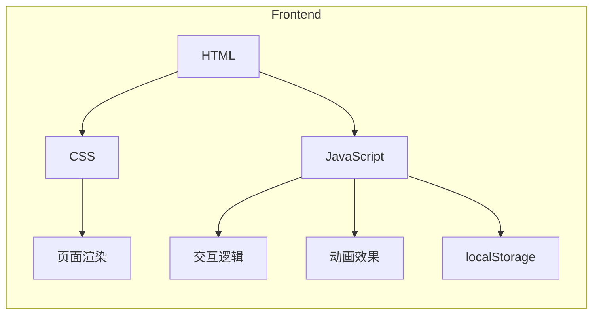

## 1. Architecture Design


## 2. Technology Description
- Frontend: 纯 HTML + CSS + JavaScript（无框架）
- 无需后端服务，完全在浏览器端运行
- 数据存储：localStorage 用于记录完成状态

## 3. 文件结构
```
/Users/j0luo/Downloads/课业辅助工具/人文关怀小demo/
├── index.html              # 主入口文件
├── css/
│   └── styles.css          # 全局样式
└── js/
    └── app.js              # 应用逻辑
```

## 4. 页面状态管理
使用 JavaScript 对象管理页面状态：
```javascript
const appState = {
    currentPage: 'opening',    // opening, hall, script, science, empathy, resources
    energy: 100,               // 能量值 0-100
    currentScene: 1,           // 当前场景 1-5
    depressionCompleted: false // 抑郁症体验是否完成
};
```

## 5. 核心功能实现方案

### 5.1 页面切换
- 使用 CSS `display` 和 `opacity` 属性实现淡入淡出
- 所有页面在一个 HTML 文件中，通过 JS 控制显示/隐藏

### 5.2 双声道视觉系统
- 使用 CSS 滤镜和类切换实现表层/内心世界的转换
- 故障艺（Glitch）效果使用 CSS `transform` 和 `animation`

### 5.3 能量条系统
- 使用 CSS 变量控制环境光亮度
- 能量值变化时更新 CSS 变量和滚动速度

### 5.4 场景交互
- 场景1：使用 `mousedown`/`touchstart` 和 `mouseup`/`touchend` 事件实现长按检测
- 场景2A：使用 `requestAnimationFrame` 实时更新微笑弧度
- 场景2B：使用 `setInterval` 生成弹幕，点击事件击碎词汇
- 场景4：使用 `mouseenter`/`mouseleave` 事件实现选项消逝
- 场景5：点击镜子触发序列动画

### 5.5 逐字显示动画
- 使用 JavaScript 循环逐个字符添加到 DOM
- 配合 CSS `animation` 实现文字效果

### 5.6 视差滚动
- 监听 `scroll` 事件，根据滚动位置显示/隐藏内容
- 使用 CSS `transform` 实现平滑过渡

## 6. 响应式设计
- 使用 CSS 媒体查询适配不同屏幕尺寸
- 触摸事件优先，同时支持鼠标操作
- 弹性布局和相对单位（em/rem/vh/vw）

## 7. 本地存储
```javascript
// 保存完成状态
localStorage.setItem('depressionCompleted', 'true');

// 读取完成状态
const isCompleted = localStorage.getItem('depressionCompleted') === 'true';
```
