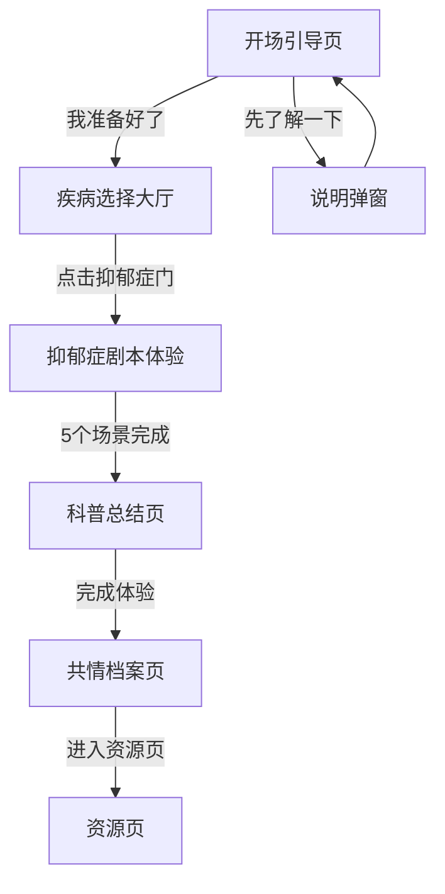

## 1. Product Overview
「心影」是一个抑郁症科普体验Web应用，通过沉浸式的交互设计让用户体验抑郁症患者的内心世界，从而增进理解和共情。
- 主要目的：通过体验式科普消除对抑郁症的误解，普及科学知识
- 目标用户：普通大众、希望了解抑郁症的人群

## 2. Core Features

### 2.1 Feature Module
1. **开场引导页**：灰色城市背景，文字逐行显示，两个操作按钮
2. **疾病选择大厅**：6扇门，仅抑郁症门可用，显示患者内心独白
3. **抑郁症剧本体验**：5个场景，双声道视觉系统，能量条系统
4. **科普总结页**：体验回顾、误解澄清、科学解释、建议、真实数据
5. **共情档案页**：总结语，海报生成功能
6. **资源页**：心理援助热线、鼓励话语

### 2.3 Page Details
| Page Name | Module Name | Feature description |
|-----------|-------------|---------------------|
| 开场引导页 | 背景与文字 | 灰色城市背景，行人剪影，文字逐行显示动画 |
| 开场引导页 | 操作按钮 | 「我准备好了」进入下一页，「先了解一下」弹出说明弹窗 |
| 疾病选择大厅 | 门的布局 | 6扇门，仅抑郁症门可用，显示「我已经很久没有真正笑过了」 |
| 疾病选择大厅 | 状态标记 | 使用localStorage记录完成状态，已完成显示标记 |
| 剧本体验 | 能量条系统 | 环境光效果，随剧情下降 |
| 剧本体验 | 双声道视觉 | 表层画面+内心独白，故障艺效果，暗角，灰蓝色调 |
| 剧本体验 | 场景1-沉重唤醒 | 长按交互，前2秒无反应，画面缓慢亮起 |
| 剧本体验 | 场景2A-维持微笑 | 点击/按住维持微笑弧度，松开弧度下落 |
| 剧本体验 | 场景2B-自我攻击弹幕 | 灰色词汇弹幕，点击击碎，最终淹没屏幕 |
| 剧本体验 | 场景3A-摘下面具 | 物理压迫感交互，头像变大挤压，话语成墙 |
| 剧本体验 | 场景4-夜晚 | 选项消逝，发出消息的迟疑（3-5秒停顿） |
| 剧本体验 | 场景5-镜子 | 对视交互，镜子里的人看向用户，留下水汽/裂痕 |
| 剧本体验 | 过渡动画 | 从深海浮出水面，光斑渗入，色调过渡 |
| 科普总结页 | 视差滚动 | 内容分段显示，误解划掉效果 |
| 共情档案页 | 总结与分享 | 总结语，海报生成按钮 |
| 资源页 | 援助与鼓励 | 心理援助热线，鼓励话语 |

## 3. Core Process
用户从开场引导页开始，通过疾病选择大厅进入抑郁症剧本体验，完成5个场景后进入科普总结页，然后是共情档案页，最后到达资源页。

## 4. User Interface Design
### 4.1 Design Style
- 主色调：蓝灰色系（#2C3E50, #34495E, #5D6D7E, #85929E）
- 辅助色：暗红色（#C0392B）用于强调，浅暖色调（#F8E9A1）用于治愈场景
- 按钮风格：圆角矩形，悬停时有阴影效果
- 字体：标题用具有艺术感的手写体或衬线字体，正文用清晰的无衬线字体
- 布局风格：全屏沉浸式，无传统导航栏，通过场景切换
- 动画风格：故障艺（Glitch）、暗角、淡入淡出、逐字显示

### 4.2 Page Design Overview
| Page Name | Module Name | UI Elements |
|-----------|-------------|-------------|
| 开场引导页 | 背景与文字 | 灰色城市背景，行人剪影模糊，主角清晰，文字逐行显示 |
| 疾病选择大厅 | 门的布局 | 6扇门排成两排，每扇门有患者内心独白，抑郁症门高亮 |
| 剧本体验 | 能量条 | 环境光效果，而非传统进度条 |
| 剧本体验 | 内心独白 | 灰色斜体浮动文字，手写体，轻微颤抖动画 |
| 科普总结页 | 内容展示 | 视差滚动，误解划掉效果，分段出现 |
| 共情档案页 | 总结与分享 | 温暖色调，居中布局，海报生成按钮 |
| 资源页 | 援助与鼓励 | 卡片式布局，热线电话突出显示 |

### 4.3 Responsiveness
- 移动端优先，自适应各种屏幕尺寸
- 触摸优化，支持长按、滑动等手势
- 响应式布局，在手机和电脑上都有良好体验

### 4.4 视觉特效
- 故障艺（Glitch）效果：当内心独白出现时，画面产生微小故障
- 暗角效果：画面边缘出现黑边
- 色彩抽离：瞬间变成灰蓝色调
- 崩溃场景：屏幕像被墨水浸染一样变黑
